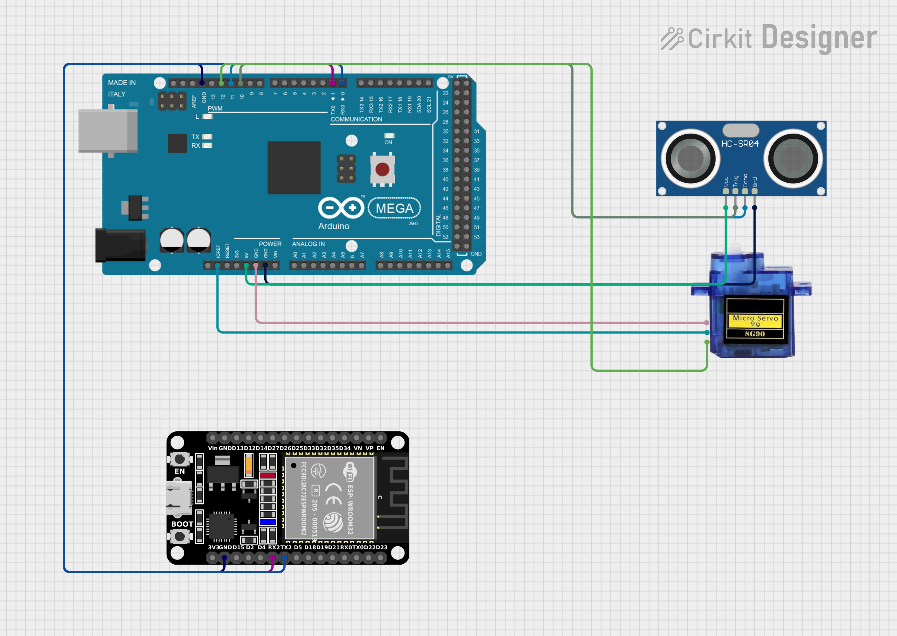

# Wi-Fi Radar System with Object Detection and Web Interface (Using ESP32)

📌 This repository contains the implementation of a **Wi-Fi Radar System** that uses an **ultrasonic sensor** to detect objects and transmits the distance data to a **web server** using **ESP32**. The detected objects are also displayed on a **graphical interface**, with real-time updates on their positions and distances.

---

## 📖 Table of Contents  
- [📌 About](#-about)  
- [🚀 Components Used](#-components-used)  
- [🔌 Connection Setup](#-connection-setup)  
- [🚀 Running Instructions](#-running-instructions)  

---

## 📌 About  

This project is designed to detect objects using an ultrasonic sensor, and the distances to these objects are sent to a web server. Simultaneously, the data is displayed on a graphical interface for real-time monitoring. The ultrasonic sensor is mounted on a **180-degree** servo motor for wider coverage. The entire system is controlled using an **Arduino Mega 2560** and an **ESP32** module for Wi-Fi connectivity.

---

## 🧰 Components Used  

-   **Arduino Mega 2560**: The main microcontroller that controls the ultrasonic sensor, servo motor, and communication with the ESP32.
-   **ESP32**: Wi-Fi module used to transmit distance data from the Arduino to the web server.
-   **Ultrasonic Sensor**: Measures the distance from the sensor to an object.
-   **180° Servo Motor**: Rotates the ultrasonic sensor to scan a larger area.
-   **Graphical Interface** (PC or Device): Displays real-time data and object positions

---

## 🔌 Connection Setup

<table>
	<tr>
		<th>
			Wiring Diagram
		</th>
	</tr>
	<tr>
		<td>
			
		</td>
	</tr>
</table>

---

## 🚀 Running Instructions

-   Upload the Code to Arduino Mega: First, upload the radar.ino code to the **Arduino Mega 2560** using the Arduino IDE. This code controls the ultrasonic sensor and the 180° servo motor, allowing the radar system to detect objects.
-   Run the Graphical Interface: After uploading the code to the Arduino, run the graphical interface on your PC or device. The interface will display real-time updates of the objects detected by the ultrasonic sensor, showing their positions and distances.
-   Start the ESP32 Code: **Without stopping the running system**, open and upload the ESP32 code to the ESP32 module. This will enable the Wi-Fi communication between the Arduino and the web server. Once the ESP32 code starts running, the distance data from the sensor will be transmitted to the web server.
-   Access the Web Server: Open your web browser and navigate to the web server's address to view the real-time distance data coming from the radar system. The server will display the distances of objects detected by the ultrasonic sensor in real-time, as they are updated from the ESP32.